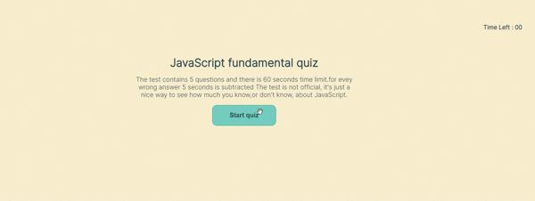

# JavaScript-Quiz

## About The Project

This project is about creating a quiz for the client. When the user starts the quiz, multiple questions will be shown one after the other when the user clicks the correct or wrong answer, and the score is stored if the user clicks the correct answer. When the user selects the wrong answer, the 5 seconds will be subtracted from the interval remaining. The user needs to enter their initials  and submit them to show the score 
## Technologies used

- html
- css
- java script

## functionality issues
- score is not taking correct value

## Development process
- created the HTML pages
- given styling for the pages
- added questions in script.js
- made the questions displayed on the page
- added the functionality by clicking the text appears whether the text is correct or wrong answer
- created high score HTML page
- given styling to high score page
- worked on local storage 
- quiz finished successfully

## The following appearance of the site:

# URL of the website
https://rammohanmiryala.github.io/Javascript-Quiz/
